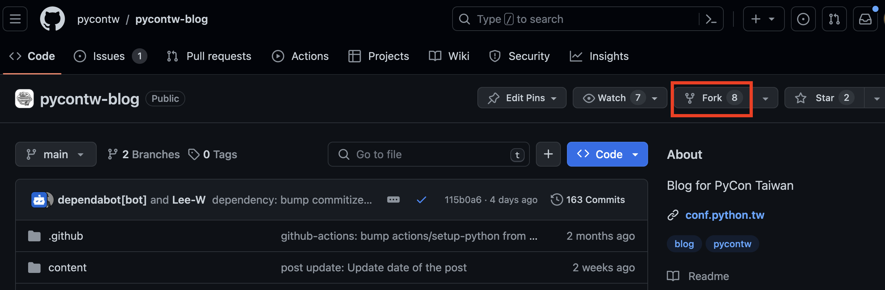
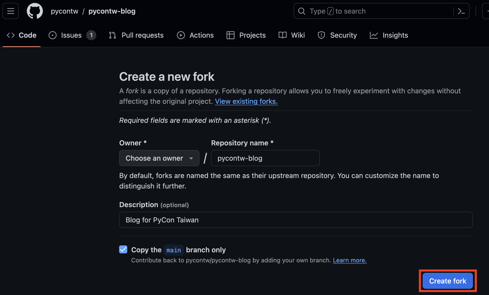
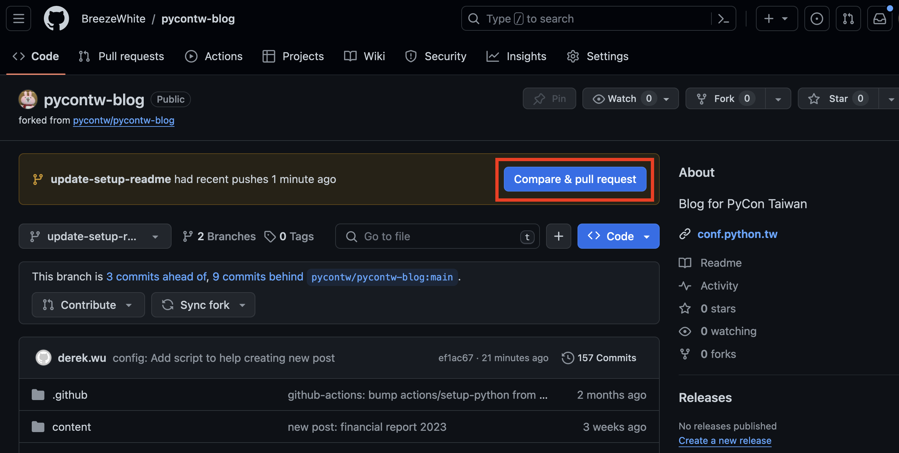

[](http://makeapullrequest.com)
[](https://github.com/psf/black)

# PyCon Taiwan Blog

## Getting Started
### Environment Setup

1. Fork & Clone [pycontw-blog](https://github.com/pycontw/pycontw-blog)

    For those who already know how to fork the repository, you can skip to the next step.

    <details>
    <summary> Click me</summary>

    1.1 Navigate to [pycontw-blog](https://github.com/pycontw/pycontw-blog) and press the `Fork` button
    on the top right corner.
    

    1.2 Press `Create fork`
    

    1.3 Copy the URL of the forked repo
    
    </details>

2. Clone the forked repo

    ```bash
    git clone --recursive <YOUR_URL_HERE>
    ```

3. Install [miniconda](https://docs.anaconda.com/free/miniconda/#quick-command-line-install)

    Use `miniconda` to setup the required version of Python.
    Choose the code to execute depending on your OS.

    <details>
    <summary>(click me) Mac OS M-series chip</summary>

    ```bash
    mkdir -p ~/miniconda3
    curl https://repo.anaconda.com/miniconda/Miniconda3-latest-MacOSX-arm64.sh -o ~/miniconda3/miniconda.sh
    bash ~/miniconda3/miniconda.sh -b -u -p ~/miniconda3
    rm -rf ~/miniconda3/miniconda.sh
    ~/miniconda3/bin/conda init zsh
    ```
    </details>

    <details>
    <summary>(click me) Mac OS Intel chip</summary>

    ```bash
    mkdir -p ~/miniconda3
    curl https://repo.anaconda.com/miniconda/Miniconda3-latest-MacOSX-x86_64.sh -o ~/miniconda3/miniconda.sh
    bash ~/miniconda3/miniconda.sh -b -u -p ~/miniconda3
    rm -rf ~/miniconda3/miniconda.sh
    ~/miniconda3/bin/conda init zsh
    ```
    </details>

    <details>
    <summary>(click me) Windows</summary>

    ```bash
    curl https://repo.anaconda.com/miniconda/Miniconda3-latest-Windows-x86_64.exe -o miniconda.exe
    start /wait "" miniconda.exe /S
    del miniconda.exe
    ~/miniconda3/bin/conda init bash
    ```
    </details>

    <details>
    <summary>(click me) Linux</summary>

    ```bash
    mkdir -p ~/miniconda3
    wget https://repo.anaconda.com/miniconda/Miniconda3-latest-Linux-x86_64.sh -O ~/miniconda3/miniconda.sh
    bash ~/miniconda3/miniconda.sh -b -u -p ~/miniconda3
    rm -rf ~/miniconda3/miniconda.sh
    ~/miniconda3/bin/conda init bash
    ```
    </details>

4. Setup Python & Pipenv

    ```bash
    conda create -y -n py-blog python=3.10 pipenv
    conda activate py-blog
    ```

5. Install Dependencies
    ```bash
    pipenv install --dev
    ```

6. Setup [pre-commit](https://pre-commit.com/) hooks

    This will check common errors when you do certain types of git commits.

    ```bash
    pipenv run pre-commit install --hook-type commit-msg --hook-type pre-push --hook-type pre-commit
    ```

### Write a new article

#### Quick Start

1. Create Post

    Run the following command to create a new post. Follow the steps to fill in all necessary information.

    ```bash
    python create_post.py
    ```

    Then open the newly created file under `content/posts` to finish editing the rest of the content body.
    The post is written in Markdown format. You can learn more about Markdown [here](https://www.markdownguide.org/cheat-sheet/).

2. Test Locally

    It's very ***IMPORTANT*** to test and run locally before committing anything. Run the following command to host the website locally.

    ```bash
    pipenv run inv livereload
    ```

    After executing the above command, open your browser and navigate to `http://localhost:8000/`.
    You should be able to see the new post you've just created.

3. Commit

    After all is ready, it's time to commit the modifications to the branch and push to the repository.

    ```bash
    git add <your_file>

    # Use commitizen to do git commit.
    # Choose the "new post" type if you're adding a new article
    pipenv run cz commit

    # Push to the remote branch.
    git push origin $(git rev-parse --abbrev-ref HEAD)
    ```

4. Create Pull Request

    After pushing to the remote, go back to your github page of the forked repository. There should be a very obvious pop up on top of the page like below
    <details>
    <summary>Click me</summary>
    
    </details>

    Press that `Compare & pull request` hardly and go to the next page.

    <details>
    <summary>Click me</summary>
    
    </details>

    Modify the content of the red rectangle 1 and 2. After editing, press the `Create pull request` button. That's it!!

Congratulations!! You've done all the jobs to post a new blog article. The next is taking a rest, drinking a cup of tea, and waiting for the maintainer to come for reviewing your PR ~


#### More about the post

The post could be written in Markdown or reStructuredText format. The file should put under `content/posts` folder. Your filename should be the English title of your article. You'll have to translate it if there's no English title.

The following is a minimal example of an article.
* In markdown
    ```markdown
    Title: My super post
    Date: 2010-12-03 10:20
    Modified: 2010-12-05 19:30
    Category: Python
    Tags: pelican, publishing
    Slug: my-super-post
    Authors: Alexis Metaireau, Conan Doyle
    Summary: Short version for index and feeds

    This is the content of my super blog post.
    ```
* In reStructuredText
    ```reStructuredText
    My super post
    ##############

    :date: 2010-10-03 10:20
    :modified: 2010-10-04 18:40
    :tags: that's, awesome
    :category: yeah
    :slug: my-super-post
    :authors: Alexis Metaireau, Conan Doyle
    :summary: Short version for index and feeds
    ```

    Please read [Writing content](https://docs.getpelican.com/en/latest/content.html) section in pelican documentation for format detail.

### How do we organize our data in the `content` directory?
TBD

## Authors
Wei Lee <weilee.rx@gmail.com>
Yoyo <miyashita2010@tuta.io>
